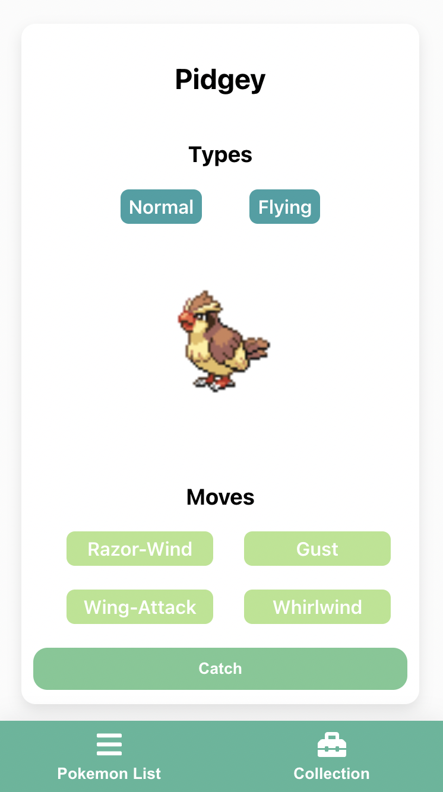

## Pokemon, Catch 'em all 💪! 

Web app created with React and [PokeApi](https://pokeapi.co/)

Demo: https://poke-ball-go.web.app/

### What this web have

This web app have list of pokemons, you can catch them with some probabilites. Collect your own pokemon!

    

### Tech Stack

- React
- Apollo Client
- Emotion

### Run locally

Clone this repository

run `npm install` to install all dependencies

run `npm start` to start on development mode